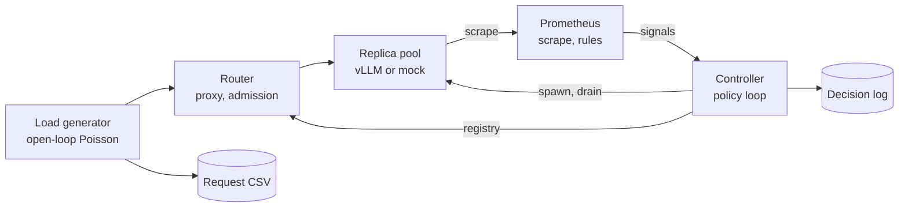

1. System overview

The system splits into a data plane (load generator, router, replicas: requests flowing through) and a control plane (Prometheus, controller: observing and deciding). That separation is the first design principle, and it drives a rule that shows up everywhere below: data plane decisions use local, real-time state; control plane decisions use scraped, slightly stale metrics. The router never waits on Prometheus to decide whether to reject a request, and the controller never needs per-request precision.

Five design principles govern everything else:

No Docker anywhere. Every service is a plain Python process; Prometheus and Grafana are standalone binaries (Homebrew on the Mac). This is what makes the same code and the same prometheus.yml run unchanged on the Mac and on a RunPod pod (D16).
Mock and real are interchangeable. The mock replica speaks the same HTTP API and emits the same metric names as vLLM. Nothing upstream knows which one it's talking to.
Policies are pure functions. signals in → decision out, no I/O. That makes the one piece that matters fully unit-testable.
Every decision is logged with its inputs. The decision log is the primary evidence in the writeup, not a debugging aid.
Every run is reproducible. Seeded arrivals, config snapshot, git SHA, all written to the run's results directory.
2. Deployment topologies
	Local dev (Mac)	GPU run (RunPod 3090)
Replicas	Mock replicas, spawned as subprocesses	vllm serve subprocesses sharing one GPU
Router, controller, loadgen	Python processes (uv venv)	Same
Prometheus	Homebrew binary	Standalone binary
Grafana	Homebrew binary	Runs on your Mac, reads pod Prometheus over an SSH tunnel
GPU metrics	Mock emits a fake gpu_utilization gauge	gpu_exporter via NVML
Cost	Free	~$0.20–0.40/hr

The SSH tunnel choice for Grafana is deliberate: nothing about dashboards runs on paid GPU time, and your dashboards persist on your laptop when the pod is gone.

3. Components
3.1 Replica (real: vLLM)

Each replica is a vllm serve process on its own port (8001, 8002, 8003), launched with a fixed memory fraction so three fit on the card. Key flags:

--gpu-memory-utilization 0.28   # 3 replicas × 0.28 leaves headroom
--max-model-len 4096
--no-enable-prefix-caching      # experimental cleanliness, see 3.4
--disable-log-requests

Version drift risk. vLLM has renamed metrics across releases (the KV cache gauge has appeared as both vllm:gpu_cache_usage_perc and vllm:kv_cache_usage_perc). So metric names are never hardcoded in the controller; they come from a mapping in config, and verifying them against the real /metrics is an explicit Phase 1 check.

3.2 Replica (mock)

This is the component that makes the project affordable, so it's more than a stub. It's a small discrete-time simulator of a continuous-batching engine, running in asyncio behind a FastAPI app with the same endpoints: /v1/completions (SSE streaming), /health, /metrics.

Its engine loop runs one "step" at a time:

step_time_ms = a + b · batch_size + c · prefill_tokens_this_step

Each step, it admits waiting requests while free KV blocks remain (blocks = ceil(tokens / 16)), charges prefill cost for newly admitted requests, emits one token per running sequence, grows KV allocation as sequences lengthen, and retires finished sequences. It emits the same waiting, running, KV usage, and TTFT/TPOT histogram metrics as vLLM, plus a fake gpu_utilization gauge that reads ~0 when idle and ~95–99% whenever anything is running. That last detail is what lets you reproduce the baseline scaler's failure without a GPU.

It also simulates cold start: the process doesn't bind its port for a configurable duration after launch, so health checks see connection refused, matching real vLLM, which binds only after the model has loaded (D8).

Calibration. Parameters a, b, c, total KV blocks, and cold start duration are fitted from the real Phase 3 measurements (vLLM logs its KV cache capacity at startup). Then E1 is rerun on the mock, and the two capacity curves are compared. If they diverge badly, the mock is lying and you fix it before trusting anything built against it. That validation step is worth a paragraph in the writeup on its own.

3.3 Router

A FastAPI async reverse proxy and the single entry point for all traffic. Four responsibilities.

Registry sync. Routes only to replicas in READY. Fed from static config (configs/router.yaml) until the controller exists; then it polls the controller's GET /replicas every second. If the controller is unreachable, it keeps its last known set (fail static) rather than dropping everything. On a connect failure, it retries a different replica, since nothing reached the first one (D10). It never retries mid-stream.

Balancing. Least-outstanding-requests, using the router's own in-flight counter per replica. Round robin is wrong here: with a mixed prompt-length distribution, it piles long requests onto one replica while another sits light. The balancer choice is configurable so you can show the difference if you want.

Admission control. A per-replica cap K_max on outstanding requests, derived from the E1 knee (the largest concurrency where p95 TTFT still meets the SLO). When every ready replica is at K_max, the router returns 429 with Retry-After. This decision uses the router's local counters, never Prometheus.

Streaming proxy. httpx.AsyncClient.stream upstream; the response bytes are relayed unchanged through a StreamingResponse subclass. No sse-starlette, and no request.is_disconnected() polling. Cleanup lives in the response's __call__ finally rather than the body generator's, so it also runs when a client disconnects before streaming starts; the in-flight decrement happens before any await, so cancellation can't skip it (D11). Closing the upstream connection makes the replica abort the request and free its KV blocks. Upstream read timeout is None: long queue waits under overload are the measurement (D12). Every response carries an X-Replica-Id header so the load generator can attribute latency per replica.

Router metrics: router_arrivals_total (offered load, counted on receipt, D17), router_requests_total{code} (responses; 429s from admission control will appear here), router_upstream_errors_total{replica}, router_inflight{replica} and router_replica_ready{replica} (read from the registry at scrape time), and a router_ttft_seconds histogram. The router-observed TTFT is a cross-check against vLLM's own histogram; the gap between them is your proxy overhead.

3.4 Load generator

Open-loop, not closed-loop. This is the most important correctness property in the whole measurement system. A closed-loop generator (N workers, each sending the next request when the last one finishes) automatically slows down when the server slows down, which hides exactly the queueing you're trying to measure. This is the coordinated omission problem. The generator here precomputes the full arrival schedule from a seeded Poisson process and fires each request at its scheduled time regardless of whether earlier ones have completed.

It validates itself. A run is invalid (exit code 2) if dispatch lag p99 exceeds 50 ms, peak in-flight reaches the client connection limit, any request is still in flight at the drain timeout, nothing succeeded, or the non-429 error rate exceeds 1%. A preflight request aborts a dead target before the clock starts (exit code 3). TTFT is measured from each request's intended arrival time: the latency a user would see (D13, D15). A benchmark that can't tell when its own instrument, or the system under test, is broken isn't a benchmark.

Controlled workload. Requests use ignore_eos: true with an explicit max_tokens, so output length is determined by the experiment, not by the model deciding when to stop. Prompts are random sequences from a vocabulary of words that are each a single token in Qwen's tokenizer, so word count equals token count without loading a tokenizer (D9; verified against vLLM's usage.prompt_tokens on the first GPU run). Random word order means no two prompts share a prefix, so prefix caching can't give some requests a free prefill. (Prefix caching is also disabled on the server — belt and braces.) Arrival times and request sizes come from separate seeded streams, so changing the size mix never moves an arrival (D14).

Profiles are YAML:

yaml
name: burst_short
seed: 42
phases:
  - {duration_s: 60,  rate_rps: 4}    # ~0.4x measured mock mu: fits on 1 replica
  - {duration_s: 30,  rate_rps: 16}   # the burst: ~1.7x mu, needs 2 replicas
  - {duration_s: 120, rate_rps: 4}
prompt_tokens:
  mixture:
    - {weight: 0.7, range: [100, 300]}
    - {weight: 0.3, range: [2000, 3500]}
max_tokens: {range: [64, 256]}

One CSV row per request: req_id, phase, intended_ts, prompt_tokens, max_tokens, sent_ts, first_token_ts, last_token_ts, output_tokens, server_prompt_tokens, status, replica_id, error. Rows are written as requests complete, and cancelled requests still get a row (status -1), so a run can never silently drop its slowest requests.

3.5 Controller

The core. A single asyncio loop that ticks every 5 seconds through a fixed pipeline:

MetricsSource ─▶ Signals ─▶ Policy ─▶ Stabilizer ─▶ Actuator
  (PromQL)       (typed,     (pure      (cooldowns,    (Backend
                 staleness   function)  bounds,         spawn /
                 checked)               pending acct)   drain)
                                  │
                                  └──▶ Decision log (JSONL)

Signals is a frozen dataclass assembled each tick:

python
@dataclass(frozen=True)
class Signals:
    ts: float
    ready: int
    starting: int
    draining: int
    waiting_total: float
    running_total: float
    kv_usage_max: float          # worst replica, not average
    ttft_p95_s: float | None
    queue_slope_per_s: float     # from PromQL deriv()
    arrival_rate_rps: float      # from router, includes rejected
    gpu_util_mean: float
    stale: bool

kv_usage_max uses the worst replica rather than the mean on purpose: one replica at 98% cache is about to start preempting even if the average looks fine. arrival_rate_rps includes rejected requests, because offered load is what you're sizing for, not the load you chose to admit.

Policies implement one interface:

python
class Policy(Protocol):
    name: str
    def decide(self, s: Signals) -> Decision: ...  # config is bound at construction

@dataclass(frozen=True)
class Decision:
    desired: int
    reason: str
    inputs: dict[str, float]

Three policies, each a step up in sophistication:

Policy	Rule	Role
UtilPolicy	ceil(current × util / target) — the HPA formula	Baseline. Expected to fail.
QueuePolicy	ceil(currenUtilPolicy	ceil(current × util / target), held within HPA's 10% tolerance band — the HPA formula, faithfully	Baseline. Expected to fail.
QueuePolicy	ceil((running + waiting) / target_concurrency), Knative-style, with a KV-pressure override	The first correct signal
PredictivePolicy	max of ceil(λ / (μ · ρ_target)) and ceil((running + waiting + max(slope, 0) × T_cold) / target_concurrency)	Accounts for cold startt × (waiting per replica / target)), with a KV-pressure override	The first correct signal
PredictivePolicy	Size for waiting + slope × T_cold (projected queue when a new replica would actually arrive), floored by the Little's-law capacity model ceil(λ / (μ · ρ_target))	Accounts for cold start

PredictivePolicy is the interesting one. μ is per-replica service rate measured in E1, ρ_target is a target utilization (say 0.7), and T_cold is the measured cold start. It asks: "given how fast the queue is growing, what will it be by the time a new replica is ready?" rather than "what is it now?" That's the direct answer to the cold-start floor problem.

Stabilizer turns a raw desired count into a safe action:

Pending-capacity accounting. Effective current = ready + starting. Without this, the controller sees a high queue while replica 2 is still booting, adds replica 3, then 4, and overshoots. This is the classic autoscaler bug and worth a deliberate test.
Scale-up: at most +2 per tick, then a cooldown equal to T_cold.
Scale-down: only if every desired value over a 90-second window was below current, so a brief lull doesn't trigger a drain; one replica per action; never while a replica is starting or draining.
Every outcome, including every kind of hold, carries a named reason for the decision log. The stabilizer is shared by all policies, so comparisons measure policies, not damping (D21).
Hard bounds: min_replicas, max_replicas (the latter derived from VRAM: 3 on the 3090).
Stale data means hold. If signals.stale, no action. Never scale on missing data, and never interpret "Prometheus is down" as "load is zero."

Replica lifecycle is an explicit state machine owned by the controller:

State	Entered when	Router routes to it?	Counts toward capacity?
STARTING	Process spawned	No	Yes (pending)
READY	/health 200 and warmup request succeeded	Yes	Yes
DRAINING	Selected for scale-down	No	No
TERMINATED	In-flight reached 0 or drain timeout	No	No
FAILED	Health fails 3× or process exits	No	No (replaced)

The warmup request before READY matters: the first request after load triggers CUDA graph capture and compilation, and you don't want a real user paying for it.

Drain sequence for scale-down: pick the replica with the fewest in-flight requests, mark it DRAINING, wait for the router to drop it (≤1s poll interval), wait until its in-flight count reaches 0 or drain_timeout_s (120s) elapses, then SIGTERM, then SIGKILL after 10s. The ordering matters because vLLM aborts in-flight generations on SIGTERM. Signal before draining and you truncate responses.

Backends isolate the "how" of scaling:

python
class ReplicaBackend(Protocol):
    async def spawn(self, replica_id: str, port: int) -> ReplicaHandle: ...
    async def terminate(self, h: ReplicaHandle, grace_s: float) -> None: ...
    async def discover(self) -> list[ReplicaHandle]: ...

MockBackend spawns mock replicas, ProcessBackend spawns vllm serve, and a K8sBackend that patches a Deployment's replica count is the stretch goal. discover() exists for crash recovery: on restart, the controller reconciles with whatever processes are already running instead of spawning duplicates.

Service discovery. Replicas come and go on dynamic ports, so Prometheus can't use a static target list. The controller writes targets/replicas.json (atomically: temp file then rename) and Prometheus watches it via file_sd_configs. No service mesh, no restarts.

The controller also exposes its own metrics (controller_desired_replicas, controller_ready_replicas, controller_decisions_total{policy,reason}) and an HTTP API: GET /replicas, GET /state, POST /policy for switching policies between runs.

3.6 GPU exporter

A ~40-line NVML exporter exposing isa_gpu_utilization_percent and memory used. One caveat to state upfront: all replicas share one physical GPU, so this is per-GPU, not per-replica. For the baseline policy that's fine — it's the same signal a real HPA would see.

3.7 Observability

Prometheus scrapes every target at 2s (default 15s is far too coarse for a system whose events last tens of seconds). Recording rules precompute the controller's inputs so queries stay cheap and consistent:

yaml
- record: isa:waiting:sum
  expr: sum(vllm:num_requests_waiting)
- record: isa:waiting:slope30s
  expr: deriv(isa:waiting:sum[30s])
- record: isa:ttft:p95_30s
  expr: histogram_quantile(0.95, sum by (le) (rate(vllm:time_to_first_token_seconds_bucket[30s])))
- record: isa:arrival:rps30s
  expr: sum(rate(router_arrivals_total[30s]))

deriv() does a least-squares linear fit over the window, which is far more robust to scrape noise than differencing two samples. tests/test_observability.py enforces that the metric names in metrics_map.yaml, rules.yml, and the dashboard JSON all agree, so a rename can't produce a silently empty panel (D18).

Grafana dashboards are provisioned from JSON in the repo: an SLO panel (p95/p99 TTFT with the SLO line), queue depth, replica count by state, GPU utilization, rejection rate, and controller decisions as annotations on the time axis.

4. The control loop latency budget

This is the section that explains the whole project's central finding, so it gets its own heading. End-to-end reaction time from "load changes" to "new capacity serving traffic":

Stage	Worst case
Scrape interval	2s
Rule evaluation	2s
Rate window lag (30s windows smooth the signal)	~10–15s effective
Controller tick	5s
Detection subtotal	~20s
Process spawn + weight load + cache init + warmup	T_cold, measured (expect 40–90s)
Total reaction time	~20s + T_cold

Any burst shorter than that total is invisible to a reactive scaler: it's over before new capacity arrives. Shrinking the detection subtotal (shorter windows) makes the signal noisier and the scaler twitchier; that trade is a tunable you can show. But T_cold dominates, and no signal choice removes it. That's why the architecture has two independent defenses: PredictivePolicy scaling ahead of the queue, and admission control protecting admitted traffic when prediction isn't enough.

5. Failure modes
Failure	Behavior
Controller crash	Router keeps last-known replicas; replicas keep serving. On restart, discover() reconciles. No traffic loss.
Replica crash	Router gets connection errors, controller sees health failures → FAILED → replacement spawned.
Prometheus down / stale	Controller holds current count. Admission control continues (it's local to the router).
VRAM exhausted on spawn	vLLM fails to start → FAILED; max_replicas should prevent this, so it's also logged as a config error.
Flapping	Scale-down stabilization window and scale-up cooldown.
Overshoot during boot	Pending-capacity accounting.
Load generator saturation	Scheduling-lag check invalidates the run.
Forgotten pod burning credits	Watchdog (§8).

6. Known risk: co-located replicas

The honest weak point. Three replicas on one GPU don't have three GPUs' worth of capacity. Without MPS, CUDA time-slices between processes rather than running their kernels concurrently. A 0.5B model tends to be bottlenecked on per-step CPU and kernel-launch overhead rather than the GPU itself, which leaves idle gaps another process can fill — so scaling may be close to additive, but that's a hypothesis, not a fact.

So it gets measured, as experiment E1b: aggregate saturated throughput at 1, 2, and 3 replicas. If 2 replicas give ≥1.7× throughput, the co-located design is sound. If much less, the fallback is a 2×3090 pod for the Phase 6 comparison only — about 2 hours at double the rate, still inside budget. Either result goes in the writeup; the mock gets a scaling_efficiency parameter fitted from it so the local simulation stays honest.

7. Experiments
ID	Question	Setup	Primary chart
E0	What is T_cold?	5 cold starts	Startup phase breakdown
E1	Where is the knee? Is GPU util flat?	1 replica, sweep λ	TTFT p99 + GPU util vs λ
E1b	Do co-located replicas scale?	1/2/3 replicas at saturation	Throughput vs replica count
E2	Does util-based scaling fail?	UtilPolicy, burst profile	TTFT p99 + replicas over time
E3	Does queue-based scaling work?	QueuePolicy, same burst	Overlay with E2
E4	Can prediction beat the cold-start floor?	PredictivePolicy, short burst	Overlay with E3
E5	Does shedding protect admitted traffic?	Admission on vs off, overload	Admitted p99 vs rejection rate
E6	Is scale-down lossless?	Drain on vs off, mid-generation	Truncated responses count

E1, E1b, E0, and the live runs of E2–E4 need the GPU. E5 and E6 can run on the mock once it's calibrated.

8. Experiment runner and cost control

scripts/run_experiment.py --config configs/experiments/e3_queue_burst.yaml does one full run: creates results/<timestamp>_<name>/, snapshots the config and git SHA, starts the controller with the chosen policy, waits for min_replicas to be READY, runs a warmup, runs the load profile, exports the relevant Prometheus range queries to CSV, copies the decision log, and shuts down cleanly. The analysis scripts read only from that directory, so every chart is regenerable from committed data.

scripts/pod_watchdog.sh runs on the pod and removes it after a configurable idle period, using runpodctl and the pod's own ID from its environment. This is the most direct protection your $14 has — an idle pod left running overnight is the single most likely way to lose the budget. We'll verify that mechanism works on the pod before trusting it.

9. Repository layout
inference-slo-autoscaler/
├── docs/            ARCHITECTURE.md  HANDOFF.md  MANIFEST.md
├── configs/
│   ├── slo.yaml
│   ├── metrics_map.yaml          # vLLM metric names, per version
│   ├── policies/                 # util.yaml queue.yaml predictive.yaml
│   ├── profiles/                 # steady.yaml sweep.yaml burst_short.yaml …
│   └── experiments/              # e0 … e6
├── src/isa/
│   ├── common/                   # config.py log.py buckets.py
│   ├── mock_replica/             # engine.py driver.py server.py metrics.py __main__.py
│   ├── router/                   # app.py registry.py balancer.py config.py metrics.py __main__.py
│   ├── controller/
│   │   ├── loop.py  signals.py  stabilizer.py  lifecycle.py  api.py  sd.py
│   │   ├── policies/             # base.py util.py queue.py predictive.py
│   │   └── backends/             # base.py mock.py process.py
│   ├── loadgen/                  # profile.py schedule.py client.py report.py runner.py __main__.py
│   ├── gpu_exporter/
│   └── analysis/                 # load.py charts.py report.py
├── deploy/
│   ├── prometheus/               # prometheus.yml rules.yml targets/
│   └── grafana/                  # provisioning/ dashboards/
├── scripts/                      # dev_mocks.sh dev_observability.sh (later: run_experiment.py pod_bootstrap.sh pod_watchdog.sh)
├── tests/
└── results/

10. Stack

Python 3.12 with uv for environment and dependency management. FastAPI + uvicorn for the router, controller API, and mock. httpx for all async HTTP. prometheus-client for exporting metrics. pydantic v2 for typed config. PyYAML for profiles and config. nvidia-ml-py for NVML (pod only). Prometheus and Grafana as Homebrew binaries locally, standalone binaries on the pod. pandas + matplotlib for analysis (to be added). pytest + pytest-asyncio for tests. vLLM pinned to one version on the pod. Versions get pinned at install time and recorded in MANIFEST.md.

11. Build order

The build follows the phase plan, with one refinement: the mock replica comes before anything else in the data plane, since everything downstream is developed against it.

Phase 0 is the repo skeleton, config models, and the mock replica with its engine. Phase 1 is the router against 1–3 mock replicas. Phase 2 is the load generator with its lag check. Phase 3 is Prometheus, recording rules, and Grafana, all local. Phase 4 is the controller with MockBackend and all three policies under unit test. Phase 5 is the first GPU session: ProcessBackend, metric-name verification, E0, E1, E1b, then pulling data off the pod. Phase 6 is calibrating the mock and validating it against E1. Phase 7 is the live policy comparisons, E2 through E4. Phase 8 covers admission control and drain, E5 and E6. Phase 9 is the writeup.

GPU time is concentrated in two sessions (Phase 5, Phase 7), which keeps the pod lifecycle simple and the budget predictable.

Read through it and push back on anything — this is the cheapest point to change the design. The decisions most worth a second look are the three-replicas-on-one-GPU approach (§6) and whether you'd rather start with 0.5B or 1.5B. When you're happy, step 1 is installing uv, creating the repo, and saving this as docs/ARCHITECTURE.md.